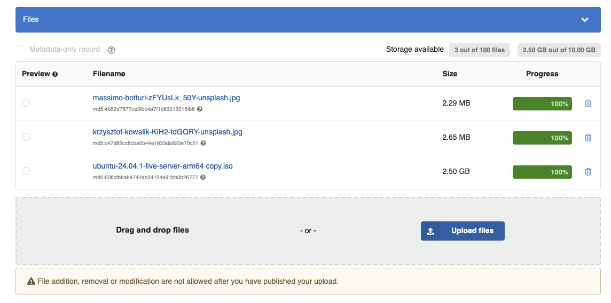
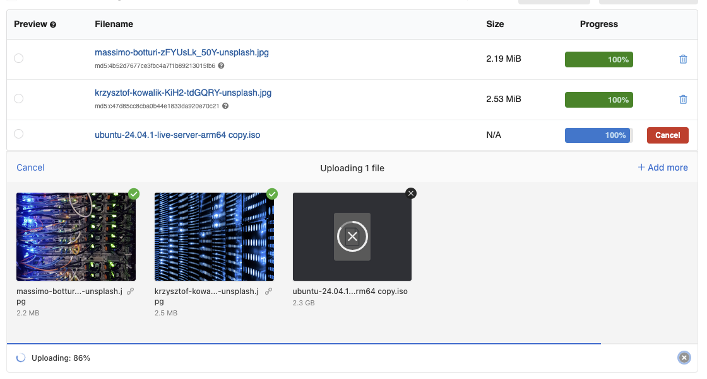

# Files uploaders

In InvenioRDM, records can have file uploads attached to it. The file uploader interface is
available from the [**upload form**](../../../use/records/upload.md).

## Default file uploader



By default, the system provides a simple and robust file upload interface that:

- Allows uploading one or more files using the file picker or drag-and-drop.
- Displays a list of uploaded files with filename, size, and delete option.
- Progress indicators show the status of ongoing uploads.
- Ensures that all files are successfully uploaded before publishing the record.

This interface is stable and well-integrated with all InvenioRDM workflows. Its look
and feel can to a certain point be customized using the [React-Overridable](../look-and-feel/override_components.md)
mechanism.

---

## Enhanced File Uploader (Uppy)

_Introduced in v13_



!!! warning "Experimental feature"

    The Uppy-based uploader is currently an experimental feature.
    While it offers many improvements over the default uploader, it may still
    lack support for some advanced customization scenarios or edge cases.
    Use in production systems with caution and report issues or feedback.

    **Use it at your own risk!**

You can enable a more advanced uploader UI based on the [Uppy](https://uppy.io/) JavaScript library. This uploader UI
offers a more modern user experience and powerful features—especially when working with large files or unreliable
network conditions, and media files.

See below [how to enable it](#switching-between-uploaders). Once enabled, the Uppy uploader UI completely replaces the default File Uploader implementation for users of your site.

### Key features

- **Modern drag-and-drop interface**: Easily drag files into the upload area, with real-time visual feedback and responsive layout.
- **Per-file progress tracking and error handling**: See progress, success, or failure for each file individually, with the ability to retry uploads selectively.
- **Folder uploads**: Entire directories can be selected and uploaded at once. This is especially useful for datasets with nested files or structured media. It uses the browsers' [webkitdirectory](https://developer.mozilla.org/en-US/docs/Web/API/HTMLInputElement/webkitdirectory) API.
- **Multipart upload support for large files**: When using a multipart-transfer compatible storage backend (e.g. S3):

      - Files can be split into chunks, which are uploaded in parallel, making very large file uploads much faster.

      - If a chunk fails to upload due to a random network issue, only that part is automatically retried—not the entire file—ideal for uploading multi-gigabyte research datasets, especially over unreliable networks.
      - **Per-part checksum validation** Uppy computes MD5 checksum for every chunk it uploads. Storage backend, where supported, can verify this checksum to detect any errors during transmission.

- **🌐 Resilience on unstable networks**: Uppy handles random disconnects or slow connections gracefully by retrying failed chunks or uploads and allowing
  recovery without starting over.

- **🖼️ Enhanced media file support**: Especially useful for researchers working with image data:

      - **Automatic image previews** directly in the UI before uploading
      - **Basic image editing** (e.g., crop, rotate, resize)
      - Support for extensible plugins for additional media handling or metadata entry

- **Extensible plugin system**: Add features like file validation, custom metadata fields, external file sources (e.g Google Drive, Dropbox).

- **Mobile and accessibility-friendly**: The interface adapts to small screens and includes keyboard navigation and screen-reader support where applicable.

## Switching between uploaders

You can choose which uploader to use by toggling the `APP_RDM_DEPOSIT_NG_FILES_UI_ENABLED` flag in your `invenio.cfg`:

| Uploader            | Configuration                                              |
| ------------------- | ---------------------------------------------------------- |
| Default (legacy)    | `APP_RDM_DEPOSIT_NG_FILES_UI_ENABLED = False` _(or unset)_ |
| Uppy (experimental) | `APP_RDM_DEPOSIT_NG_FILES_UI_ENABLED = True`               |

!!! warning

    When enabling Uppy, make sure that the Content Security Policy (CSP) rules are updated accordingly in your `invenio.cfg`:

    ```diff
    APP_DEFAULT_SECURE_HEADERS = {
      ...
    + 'script-src': [
    +     "'self'", "blob:", "'wasm-unsafe-eval'"
    + ],
      ...
    }
    ```

Restart your site after changing the configuration to ensure the new UI is properly loaded.
