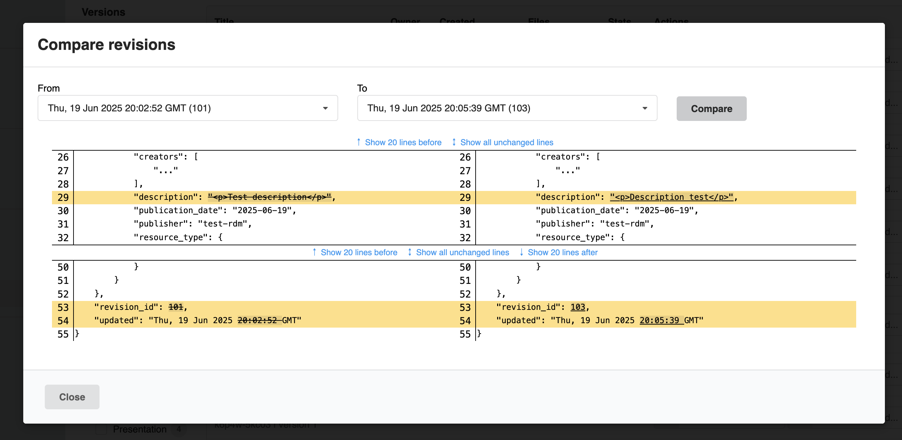
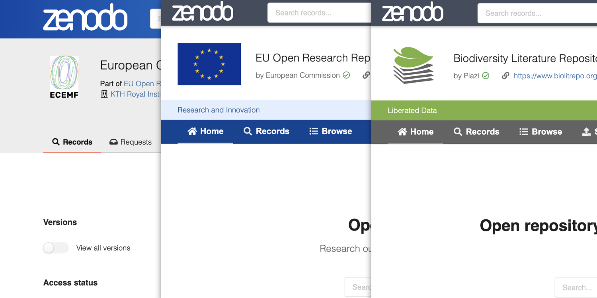

# InvenioRDM v13.0

_Draft_

_DATE_

## Try it

- [Demo site](https://inveniordm.web.cern.ch)

- [Installation instructions](../../install/index.md)

## What's new?

to complete

_TODO_: the quota feature has not been documented. It should be added, with a screenshot of the admin panel.

### Jobs and ORCID/ROR

We have upgraded to ROR version 2.0 and enhanced the metadata to include
organization aliases, status, types, locations, and acronym. It should be
easier to find the correct organization or funder you're looking for.

We have also enabled ROR updating using invenio-jobs, which lets you
automatically load the funders or affiliations vocabulary from the
InvenioRDM administration panel. You can also schedule to update your
vocabulary with new ROR releases on a regular schedule. You can find more
instructions on the [affiliations](../../operate/customize/vocabularies/affiliations.md) 
and [funders](../../operate/customize/vocabularies/funding.md) documentation pages.

Explain about the new jobs feature, logging and ORCID/ROR jobs.

Related [new doc page](../../operate/customize/vocabularies/names.md#using-orcid-public-data-sync).

### Search improvements

Addition of a [`suggest` API](../../reference/rest_api_suggest.md).

Easier to find records with accents or other non-standard characters, also searching by DOIs [PR](https://github.com/inveniosoftware/invenio-rdm-records/pull/1774)
Users can be found with partial matches [PR](https://github.com/inveniosoftware/invenio-users-resources/pull/127)
Searches like ` Universitatea "Dunărea de Jos” din Galați` now work [PR](https://github.com/inveniosoftware/invenio-app-rdm/issues/2761)

BREAKING -> mapping changes, create new indices

### Names Vocabulary

TODO
Names listing endpoint is now restricted to authenticated users, names can be "unlisted" not showing anymore in the search result for non-admin users

### Optional DOI

DOIs can now be configured as optional. Describe the feature.

### Compare revisions

The **Compare Revisions** feature allows administrators to view differences between versions of a record from the administration panel.

From the **Records** list, click the **“Compare revisions…”** button in the _Actions_ column to open a side-by-side comparison window.


#### How it works

A modal window appears, allowing you to choose two versions to compare:


Use the dropdown menus to select:

- **From**: the earlier version
- **To**: the later version

Click **Compare** to see the changes.

---

The system then displays a **side-by-side diff view** showing changes in JSON format:



#### What you can do

- Compare any two versions of a record
- View changes in metadata fields
- See added, removed, or changed values highlighted
- Use the links to expand unchanged lines before/after the highlighted differences

This is useful for:

- Reviewing metadata edits before approving changes
- Auditing updates across versions

### New Metadata Fields

There is a new field called copyright for copyright information, [specification
available here](../../reference/metadata.md). This field will require
reindexing upon the version upgrade.

There are new thesis metadata fields including department, type,
date_submitted, date_defended. thesis:university had been moved to 
university inside of the thesis:thesis section, alongside the other new fields.

There is a new edition field under imprint.

### Requests sharing

When a record is shared, its inclusion requests will be also accessible. There is a new filter in the My Dashboard to show the records shared with me.

### Audit logs

To be completed

### Communities

#### Themed communities

Communities can now have their own theming with a custom font and colors, which apply to all community pages including records and requests. Below is an example of two themed communities on Zenodo.



Themed communities benefit from a custom homepage, defined via HTML template in `<instance>/templates/themes/<theme>/invenio_communities/details/home/index.html`.

#### Subcommunities

#### Collections

Collections are a "big" feature added to v13.

!!!warning Collections require new database tables, therefore its migration recipes must be executed (`invenio db upgrade` or similar)

A collection serves as a curated set of records that are grouped based on a specific filter or query, displayed on a dedicated page, introducing a new way of organizing records within a community. For instance, a collection can be defined within a community to highlight records sharing common attributes, like funding programs or specific categories.

Collections are stored in the Database and each collection defines a search query string that is used to fetch each collection records. Find more information in the [RFC](https://github.com/inveniosoftware/rfcs/blob/master/rfcs/rdm-0079-collections.md).

**How to create a collection for a community**

Currently collections are created using a python shell (`invenio shell`)

Requirements:

- A community.
- A collection tree that acts as the "root" node of the collection.

If you do not have a collection tree, start by creating one:

```python
from invenio_collections.api import CollectionTree

ctree = CollectionTree.create(
    title="Programs", order=10, community_id="<community_uuid>", slug="programs"
)
```

The `order` parameter controls the order that trees are rendered in the UI.

Create a collection under `programs`:

```python
from invenio_collections.proxies import current_collections
from invenio_access.permissions import system_identity

collections_service = current_collections.service

# Use another identity if needed
identity = system_identity

# Desired community ID
community_id = "9d0d45ce-0ea9-424a-ab17-a72215b2e8c3"

collection = collections_service.create(
        identity,
        community_id,
        tree_slug="programs",
        slug="h2020",
        title="Horizon 2020",
        query="metadata.funding.program:h2020",
        order=10
    )
```

For nested collections, the `add` service method can be used:

```python

h2020 = collections_service.read(
    identity, community_id=community_id, tree_slug='programs', slug='h2020'
)

open_records = collections_service.add(
        identity,
        collection=h2020._collection,
        slug="h-open-records",
        title="Horizon 2020 (Open records)",
        query="access.record:public",
        order=20
    )
```

All the service methods that create collections also implements the Unit of Work pattern, so it can used if transactional consistency is needed.

The created collections can be accessed at:

- https://127.0.0.1:5000/communities/<community_slug>/collections/h2020
- https://127.0.0.1:5000/communities/<community_slug>/collections/h-open-records

Adjust the URL and `community_slug` as needed.

An overview of all the collections can be found in the community browse page (if enabled):

- https://127.0.0.1:5000/communities/<community_slug>/browse

### Helm charts

To be announced?

### Diff tool in the admin panel

Explain and screenshot of the diff tool in the admin panel

### FAIR signposting level 1

In order to increase discoverability, [FAIR signposting level 1](https://signposting.org/FAIR/#level1) can be enabled with the configuration flag `APP_RDM_RECORD_LANDING_PAGE_FAIR_SIGNPOSTING_LEVEL_1_ENABLED = True`. Once enabled, FAIR signposting information will be directly included in the `Link` HTTP response header.

[FAIR signposting level 2](https://signposting.org/FAIR/#level2) was already enabled by default since v12. The response header of each record's landing page includes a `Link` header pointing to a JSON-based linkset which contains the FAIR signposting information.

Please note that for records having many authors, files, or licenses, FAIR signposting will fall back to level 2 only, in order to avoid generating excessively big HTTP response headers.

However, since enabling FAIR signposting level 1 does increase the size of HTTP response headers, it is recommended to edit the `nginx` configuration and specify [`uwsgi_buffer_size`](https://nginx.org/en/docs/http/ngx_http_uwsgi_module.html#uwsgi_buffer_size) with a higher limit than the default values. If you have enabled `uwsgi_buffering on;`, then [`uwsgi_buffers`](https://nginx.org/en/docs/http/ngx_http_uwsgi_module.html#uwsgi_buffers) may also be adjusted.

```nginx
server {
   # ...
   # Allow for larger HTTP response headers for FAIR signposting level 1 support
   uwsgi_buffer_size 16k;
   # optional if uwsgi_buffering on;
   uwsgi_buffers 8 16k;

   # ...
}
```

### Custom schemes for persistent identifiers

The Invenio [idutils](https://github.com/inveniosoftware/idutils) module handles validation and normalization of persistent identifiers used in scholarly communication, and existing customizations may be affected by changes in v13.
The library has been restructured to use a configurable scheme system with a new entrypoint mechanism for registering custom identifier schemes.

See the [related documentation](../../operate/customize/metadata/custom_pids_schemes.md) how to add your own custom schemes.

### Miscellaneous additions

Here is a quick summary of the myriad other improvements in this release:

- The creators' roles are now displayed [PR](https://github.com/inveniosoftware/invenio-app-rdm/pull/2795)
- You can now see and show the version of InvenioAppRDM and any other module [Issue](https://github.com/inveniosoftware/invenio-app-rdm/issues/2838)
  Change the config ADMINISTRATION_DISPLAY_VERSIONS = [("invenio-app-rdm", f"v{__version__}")] and append to the list the version you want to display.
- The users API endpoint is now protected, in order to access the list of users it's required to be logged in.
- Custom awards: relaxed required fields (see [PR](https://github.com/inveniosoftware/invenio-vocabularies/pull/429))
- The configuration flags that control the visibility of menu items in the administration panel have been removed, and they are now visible by default. You can remove such flags from your configuration file (if existing) or leave them there, they will have no effect. Removed flags:
  - `COMMUNITIES_ADMINISTRATION_DISABLED`
  - `USERS_RESOURCES_ADMINISTRATION_ENABLED`
  - `JOBS_ADMINISTRATION_ENABLED`
- Following the [latest COUNTER spec](https://www.countermetrics.org/code-of-practice/), the [list of robots and machines](https://github.com/inveniosoftware/counter-robots) have been updated to ensure the stats are counted on human usage.
- Logging: The Flask root logger level has been set to `DEBUG`, enabling all log messages to pass through by default. Handlers are now responsible for filtering messages at the desired level, offering more flexibility for development and production environments.
- [Sitemaps](../../operate/customize/sitemaps.md) are now generated for search engines and other crawlers to discover and index important content (records and communities by default, but customizable). Sitemaps are even automatically linked in your `robots.txt` for ease of discoverability by machine agents.
- ...and many more bug fixes!

## Breaking changes

- Direct imports of identifier schemes (e.g., from idutils.isbn import normalize_isbn) are now deprecated and will be removed in future versions. If you have custom code that directly imports scheme modules, you'll need to update it to use the new API.

## Limitations and known issues

- fill me in

## Requirements

InvenioRDM v13 now supports:

- Python 3.9, 3.11 and 3.12
- Node.js 18+
- PostgreSQL 12+
- OpenSearch v2

Notably, older versions of Elasticsearch/Opensearch, PostgreSQL, and Node.js have been phased out.

## Upgrading to v13.0

We support upgrading from v12 to v13. See the [upgrade guide](./upgrade-v13.0.md) for how.

## Questions?

If you have questions related to these release notes, don't hesitate to jump on [discord](https://discord.gg/8qatqBC) and ask us!

## Credit

The development work of this impressive release wouldn't have been possible without the help of these great people:

- CERN: Alex, Anna, Antonio, Javier, Jenny, Karolina, Lars, Manuel, Nicola, Pablo G., Pablo P., Zacharias
- Northwestern University: Guillaume
- TU Graz: Christoph, David, Mojib
- TU Wien: Max
- Uni Bamberg: Christina
- Uni Münster: Werner
- Front Matter: Martin
- KTH Royal Institute of Technology: Sam
- Caltech: Tom
